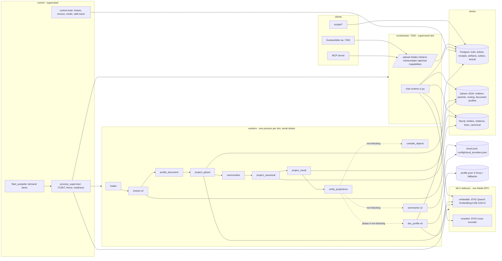

# ARCHITECTURE STATE — as the repository exists on 2026-09-07

CONFIRMED items are read from code paths named below; INFERRED items are marked. The canonical long-form architecture document is `ARCHITECTURE.md` (repo root) and the ADRs in `docs/wiki/decisions/` (0001–0017); this file is the current-state cut a successor needs first.

## 1. Top-level shape



Process boundaries: every box in `orchestrator`, `control`, `workers`, `sidecars` is a separate OS process spawned by the supervisor with the same `.env`. Stores are external local services. Cloud providers are reached only through `shared/polymath_shared/llm_extraction/client.py` with a per-lane limiter.

## 2. Stage DAG (control plane) — CONFIRMED from `control/control/tickets.py`

| Order | Stage | Event | Required artifacts | Required receipts | Gates readiness? |
|---|---|---|---|---|---|
| 1 | intake | intake.v1 | — | — | yes |
| 2 | extract | chunked.v1 | manifest | — | yes |
| 3 | profile_document | profile_document.v1 | documents_profiled | — | yes |
| 4 | project_qdrant | project_qdrant.v1 | chunk_count | qdrant | yes |
| 5 | project_neo4j | project_neo4j.v1 | facts | neo4j | yes |
| 6 | canonicalize | canonicalize.v1 | canonical_entities | — | yes |
| 7 | project_canonical | project_canonical.v1 | memberships | neo4j | yes |
| 8 | verify_projections | verify.v1 | qdrant, routing_qdrant, neo4j, canonical | — | **the QUERY_READY gate** |
| 9 | compile_objects | compile_objects.v1 | — | — | no (NON_BLOCKING) |
| 10–13 | parent_summary, document_summary, corpus_summary, vocabulary | *.v1 | — | — | no |
| 14 | doc_profile | doc_profile.v1 | doc_profile | — | no in phase A; **phase B moves it before verify and removes it from NON_BLOCKING_STAGES** |

Mechanics: `ensure_run_tickets` mints the chain for a run; tickets are lease-exclusive (`lease_owner`, `lease_expires_at`, `attempt`); the worker runtime claims gated work, runs `process_event` inside `stage_transaction`, writes artifacts + receipt; `TransientStageHold` returns the ticket READY without an attempt; failures consume an attempt; the medic and stall tracer (`control.main`) heal and report. Census verdicts are cached in `control.main` (restart it if completed runs sit at `reconciling`).

## 3. Subsystems

### 3.1 Intake and materialisation
- Purpose: accept a file, refuse duplicates, produce Markdown-shaped blocks. Inputs: `/upload` bytes or `/intake` manifest. Outputs: `documents` row (content_hash, byte_length, frontmatter), spool file, `intake.v1` event.
- Key modules: `workers/workers/intake_worker.py`, materializer 1.1.0 (HTML → Markdown-shaped), `shared/polymath_shared/dedup.py` (layer 3).
- Invariants: three duplicate layers (byte hash at upload; normalised-text hash; containment vs recent 250 docs, refuse ≥ 0.95); a landed document is exempt from re-judging on event replay.
- Failure: `NEAR_DUPLICATE_DOCUMENT` FAILURE receipt (Files tab parses it); `allow_near_duplicate` override.

### 3.2 Chunking and extraction
- Purpose: tier chunker v3.1 → parents and 128-token children (`region_role`, `heading_path`, `chunk_kind`); extraction of entities, typed relations (17 predicates + RELATED_TO from `llm_extraction/ontology.py`), facts via the cloud pool with lane rotation, AIMD limiter, receipts per call (`extraction_call_receipts`).
- Modules: `workers/workers/extract_worker.py` (×3 slots: first local-affinity, others cloud), `shared/polymath_shared/llm_extraction/{pool,client,limiter}.py`, `config/cloud_providers.json`, `config/extraction_models/limiter.yaml`.
- Invariants: chunk ids are stable; children median ≈ 73 words (DESIGN, open question with the owner); prompt or contract edits need a contract bump or blue/green re-ingest (`scripts/reingest_corpus.py --execute --blue-green`).

### 3.3 Canonicalisation and graph
- Purpose: entity admission and canonical memberships; projection to Neo4j with `entity_id` = hyphen convention (`neo4j_writer.entity_id_from_name`).
- Modules: canonicalize, project_canonical, project_neo4j workers; ADRs 0009, 0011, 0015.
- Invariants: existing graph receipts are never rewritten; Neo4j isolation by properties + `corpus_ids[]`, never id prefixing.

### 3.4 Vector and lexical projection
- Purpose: children and parents into Qdrant under the embedding contract; routing points (section summaries) for the routing lane; lexical BM25 over `routing_section_summary` and chunk text in Postgres (INFERRED for exact table names).
- Modules: `project_qdrant_worker.py` (the corpus-wide routing pass is the embedder bottleneck, ~5 texts/s), embedder sidecar.
- Invariants: collection names carry the contract id; `verify_projections` checks presence before readiness.

### 3.5 Enrichment: summaries and document profiles
- Summaries (`summary_worker` ×2): parent/document/corpus summaries + vocabulary; `parent_enrichments` keyed by a lane-free identity; non-blocking; 66 active document summaries in cinema.
- Document profiles (`doc_profile_worker` ×6, NEW): lean ≈ 500-token context (`document_profile/context.py`) → prompt v3.2 → pool (`attempt_lanes`) → `compiler.py` (rag-profile-v3, compiler v3.1) → artifact `doc_profile` → `projection.py` upsert into `polymath_document_profiles_<contract>` → artifact `doc_profile_qdrant`. Readiness half-contracts: `profile_valid` (semantic core + query hook) and `has_required_vectors` (identity + theme + a Q/SEARCH vector).
- Downstream consumers today: `scripts/document_profile_gate.py` only. Step 6 will add the retrieval lane and feed the B16 title ranker.
- Causal note for successors: the profile COMPILER's output shape determines the projection's vectors; the projection's payload (`doc_id`) is what any future lane and the gate resolve documents by. A compiler change that alters `representations` therefore changes retrieval behaviour even if the lane code is untouched; bump `COMPILER_VERSION` (it is in the stage contract hash) so existing runs are visibly on the old contract.

### 3.6 Chat runtime (orchestrator `api/ui.py`, `chat_retrieval.py`, `candidate_engine.py`)
```mermaid
sequenceDiagram
  participant U as UI
  participant C as compiler
  participant R as candidate_engine
  participant J as judge (reranker)
  participant S as synthesizer
  U->>C: message + titles block (top-40 by dense rank)
  C->>R: plan (PRIMARY + subqueries, lanes)
  R->>R: A dense, B sparse, C exact terms, D graph/facts (hop-1, <=8 seeds, <=20 facts)
  R->>R: RRF union -> region exclusion -> judged_prefix/composer
  R->>J: <=32 pairs, deadline 12 s (fallback: fusion order, degraded receipt)
  J-->>R: scores
  R->>S: evidence (legend, carry artifact on rewrite turns), presentation-v2, max 6000 tokens
  S-->>U: answer + citations; query_receipts row (meta.degraded, used_evidence)
```
- Invariants: one embedding per distinct query text; one judge call per turn; lane C starts before the embedding returns; the compiler's rewritten PRIMARY text is what retrieval embeds (so the titles-block vector cannot be reused).
- Failure: judge timeout → fusion order with `rerank_timeout` in `meta.degraded`; embedding late → `embed_deadline` degraded entry; empty retrieval → answerability gates.

### 3.7 API surface
`/upload`, `/intake`, `/api/chat` (SSE), `/retrieve` (evidence rows, modes incl. EXPLORE), `/retrieve/plan`, `/capabilities`, `/ready`, corpora document endpoints (delete with 409 `runs_in_flight`), MCP `compile_plan` / `retrieve_evidence`. Unauthenticated: local only.

### 3.8 Configuration model
`.env` (secrets + knobs; the execution contract) → supervisor overlay per spawn; `config/cloud_providers.json` (providers, `stage_pins` per stage: `doc_profile`, `chat_compiler`, extraction …); `config/extraction_models/limiter.yaml` (per-lane rpm/rpd/tpm/conc, per process); `shared/polymath_shared/settings.py` (pydantic). Chat synthesizer catalog is separate and fenced by test.

### 3.9 Observability
Fleet logs `/private/tmp/polymath_fleet/<slot>.log` (JSON lines), `receipts` / `query_receipts` / `extraction_call_receipts` / `projection_receipts` tables, `/ready` bodies, `scripts/backfill_document_profiles.py --status`, stall tracer and medic actions (migration 0053).

### 3.10 Tests and CI
- `tests/determinism`: pure pins (config, DAG, lanes, compiler shapes) and Postgres-backed stage tests with injected fakes (`HOOKS`); DB-backed tests delete their runs after each step because the live fleet adopts test corpora.
- `tests/contracts`, `tests/integration` (enrichment persistence etc.).
- CI (`.github/workflows`): agent-preflight, contracts, determinism (postgres:16 service + 53 migrations), repo-governance; research-harness for `research/`.
- Local-only failures to expect: `.env`-sourced shell → `rerank_deadline_s == 8.0` pin fails; census parity flakes while `project_qdrant` moves; one live pronoun fact endpoint in dev data.

### 3.11 Deployment
Single Mac host; `scripts/run_fleet_supervised.sh` under the supervisor with `POLYMATH_AUTOPILOT=1`; Docker only for stores (compose has `shm_size: 1gb`); a two-machine RTX cluster skill exists for ingestion (`~/.claude/skills/polymath-gpu-cluster`) — INFERRED as not in active use today.

## 4. Known limitations (current)
- Embedder throughput ≈ 5.8 texts/s regardless of callers; every projection serialises on it.
- Limiter per process; no durable RPD.
- Profiles exist but do not yet influence retrieval (step 6).
- Quota machinery in composition is present but rejected by the owner (decision pending).
- Two documents carry OCR/watermark garbage that surfaces in profiles.
